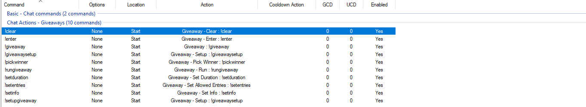

# How to install, setup and working with the commands.

### Installing the actions.
+ Copy the raw code from import code.md  and import it in to Streamer.bot, there should be 9 new Actions now. 
+ Example: 

### Setup Instructions.
+ Firstly we need to create two new text files for the Giveaway actions to use, Where you save them is ultamatly up to you
  but for example sake and my choise I'll do so in the H:\Streamer.bot x64\data\ folder.
+ You can do so by right clicking  emty space in the folder and going to new and selecting New Text Document. Now you can call
  the one ListEntries and the other one ListWinners.
+ Example: 
+ Now that our file system is ready we can head over to Streamer.bot and finish up our setup with a few more steps.
+ Under "Giveaway - Setup : !giveawaysetup" Sub-Actions you will see two file locations we need to point to our newly
  created files.
+ Example: 
+ Next we create some Chat Commands  and link them to there actions.
    + Giveaway - Setup : !giveawaysetup,      		Recommended Allow user only "The streamer".
    + Giveaway - Set Info : !setinfo,         		Recommended Allow Mods only.
    + Giveaway - Set Duration : !setduration, 		Recommended Allow Mods only.
    + Giveaway - Set Allowed Entries : !setentries, 	Recommended Allow Mods only.
    + Giveaway - Run : !rungiveaway, 			Recommended Allow Mods only.
    + Giveaway - Pick Winner : !pickwinner, 		Recommended Allow Mods only.
    + Giveaway - Clear : !clear, 			Recommended Allow Mods only.
    + Giveaway : !giveaway, 				Recommended Allow Everyone.
    + Giveaway - Enter : !enter, 			Recommended Allow Everyone.
    + Example: 
+ Finally we can run the !giveawaysetup in twitch chat to Complete our setup.
+ The Setup is now complete and you ready to learn how to use the Actions/Commands.

### How to use the Giveaway Commands.
+ Now for the Admin to get the Giveaway ready, recommended to do so before stream but can be done while streaming.
+ Using the !setinfo allows you to set the info for the give away keeping in mind twitch's 500 character limit in chat.
+ Example: 